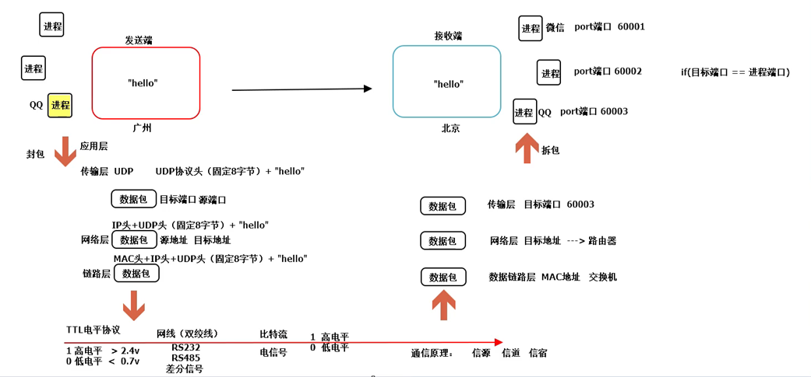
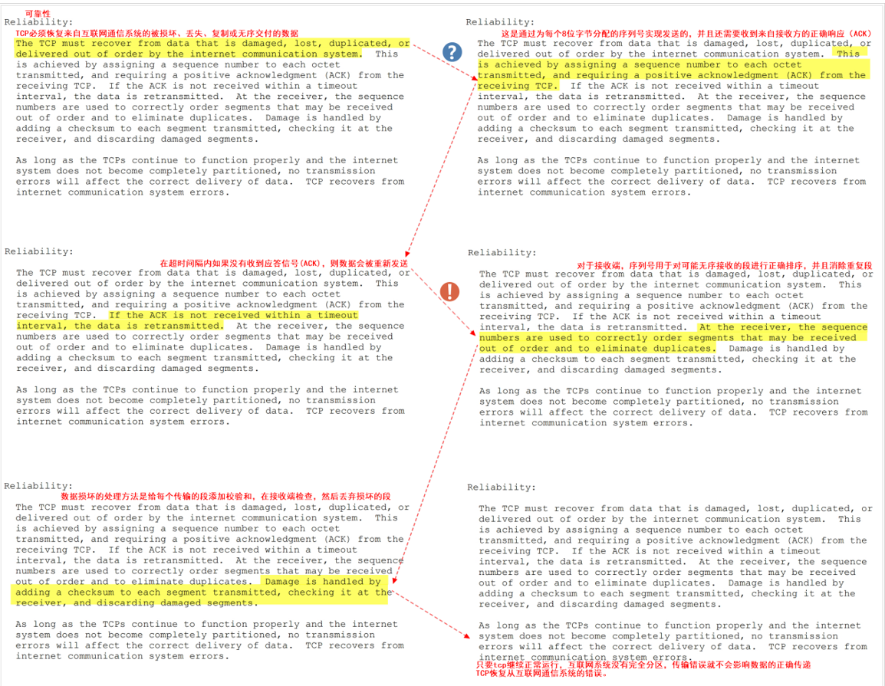
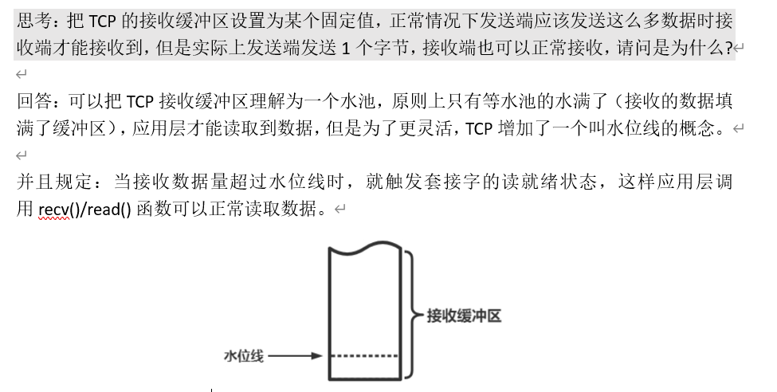
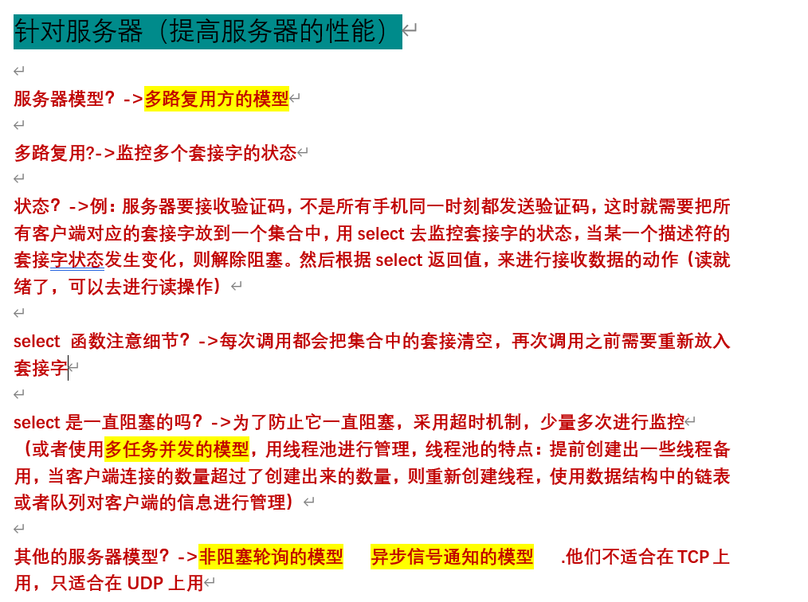
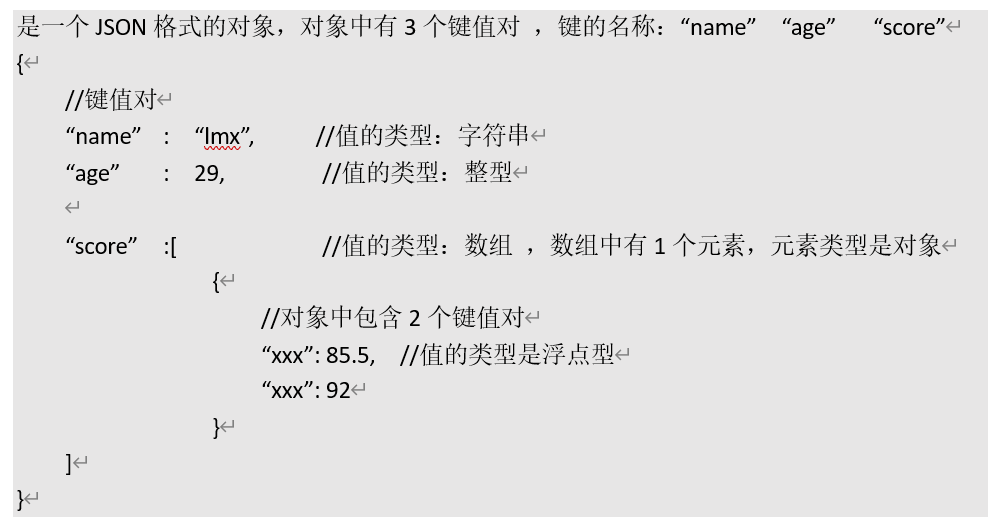
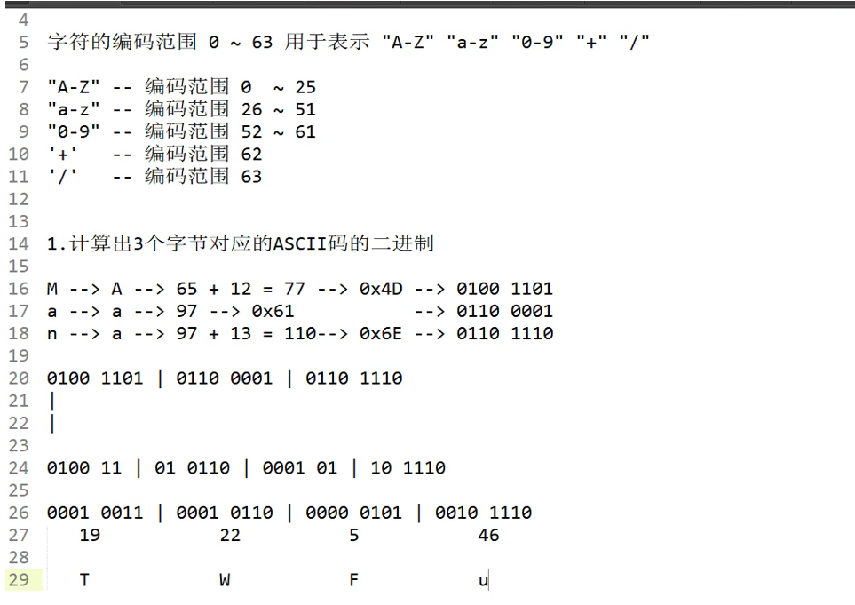
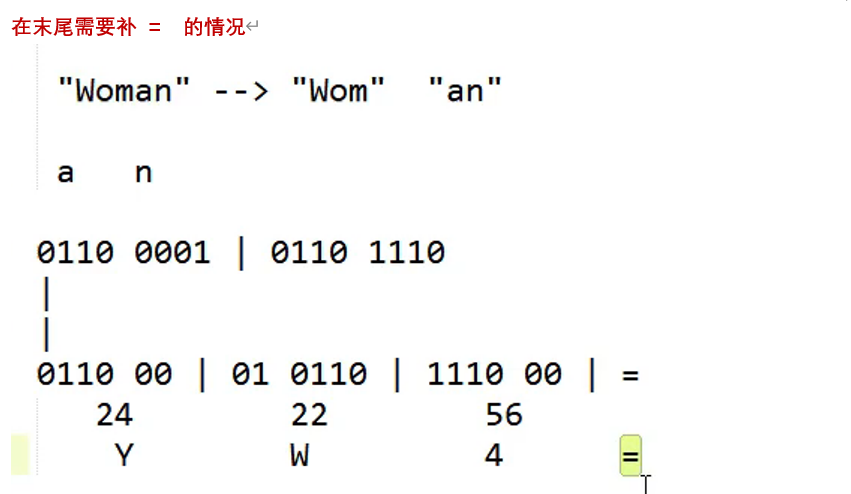

A类地址：1~126

B类地址：128~191

C类地址：192~223

------

波特率也称为码元传输速率，指的是单位时间内数字通信系统传输的码元个数，单位是波特（baud）

比特率也称为信息传输速率，指的是单位时间内数字通信系统传输的二进制码元的个数，单位是bit/s。

------

IP：互联网协议

UDP：用户数据报协议

TCP：传输控制协议

HTTP：超文本传输协议

FTP：文件传输协议

------

------

**TCP协议可靠性**

**TCP的连接机制**

基于时钟的序列号握手机制

TCP协议头的长度至少是20字节

------

------

------

------

**判断补=的方法：**

| 原始数据长度 % 3 | 说明        | 编码后补几个 `=` |
| ---------------- | ----------- | ---------------- |
| 0                | 刚好被3整除 | 不补             |
| 1                | 还差2字节   | 补2个 `==`       |
| 2                | 还差1字节   | 补1个 `=`        |

